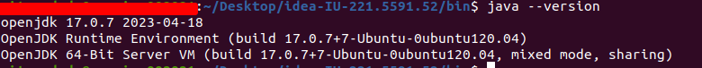

O projeto está dockerizado, então imagino que não precise do Java na máquina. Mas caso seja necessário:   Java 17, JDK 17.

Docker comandos:  
``
docker-compose start (limpar cache, caso necessário)
``

``
docker-compose up
``